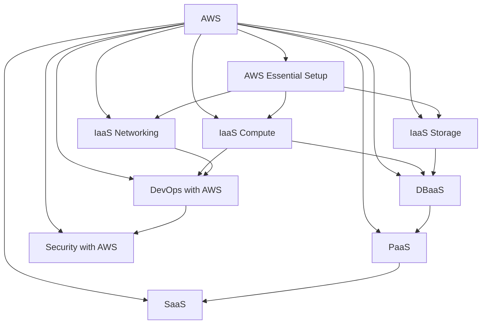

# AWS-Fundamentals-Notes
### course link: https://www.linkedin.com/learning/aws-essential-training-for-developers-17237791

#### AWS has a hundred of services and they are adding more and more...
You may not use all the services, but, you should know what you should use when you need it. 

## we gonna learn about:

### Having the basic understanding of how computer, networking and servers works is quite essential.

The aws account can be created from the link www.asw.amazon.com

There are two types of account Root Account and IAM Account

Root account is a special account by aws, and you should be aware that its like being a captain for a whole ship

Root account has features:
 - how to create IAM user
 - how to setup Root password
 - changin the support plan of aws
 - deleting the whole project

AWS tells to use the MFA for Root account

Creating an IAM User Group: In the AWS console, navigate to IAM, and create a new user group. Name it appropriately (e.g., "admins") and attach the necessary permission policies.
Assigning Permissions: Use the Administrator Access policy for broad permissions or create custom policies for specific access needs, following the principle of least privilege.
Amazon Resource Names (ARNs): Each IAM user group and other AWS resources have a unique ARN, which helps in managing and linking resources within AWS.

Creating an IAM User: Navigate to the IAM section in AWS, click on "Add users", and enter a unique username. Select "Access key - Programmatic access" and "Password - AWS Management Console access".
Setting Permissions: Assign the new user to the "admins" group and download the .csv file containing the access keys and password. Store this information securely.
Best Practices: Use autogenerated passwords and require password resets on first login. Avoid storing access keys in insecure locations or directly in source code.

## Break down the bill in AWS

Cost and Usage Widget: Use the Cost and Usage widget on the AWS console home screen to get a quick glance at your current month's usage and cost projections.
AWS Cost Explorer: Access the Cost Explorer for detailed charts and reports to see a breakdown of which AWS services are contributing to your monthly total.
Billing Preferences: Set up billing preferences to receive PDF invoices and free tier usage alerts via email. This helps you stay informed about your usage and avoid unexpected charges.
Setting a Budget: Create a budget within AWS to monitor and control your spending, ensuring it stays within your desired limits.

## On-premise infrastructure

On-Premise Hosting: Before AWS, organizations either self-hosted servers in their own data centers or rented space in co-location centers, which provided redundant power and internet.
Virtualization: The introduction of virtualization allowed a single physical server to run multiple virtual servers, optimizing resource use and enabling more flexible server management.
Evolution to Cloud: These advancements set the stage for cloud services like AWS, which offer scalable, managed infrastructure without the need for physical hardware management.

## Birth of the cloud: EC2 and S3

Elastic Compute Cloud (EC2): EC2 provides scalable virtual servers that can automatically adjust to handle varying levels of traffic, known as Auto Scaling. This helps manage sudden spikes in traffic without the need for manual intervention.
Simple Storage Service (S3): S3 offers off-premise storage for backups and important data, functioning like a cloud-based hard drive. It was a precursor to services like Dropbox, providing cost-effective storage solutions.
Infrastructure as a Service (IaaS): Both EC2 and S3 are part of AWS's IaaS offerings, allowing businesses to rent virtual servers and storage instead of maintaining physical hardware, leading to lower costs and greater uptime.

## Where in the world are your AWS services?

Availability Zones: AWS groups data centers into availability zones, ensuring redundancy and high availability. Each zone is designed to operate independently with its own power and internet providers.
Multi-AZ Architecture: AWS recommends designing your infrastructure to run across at least two availability zones to ensure high uptime and resilience against failures.
Region Selection: Choose a region close to your users that supports the AWS services you need. Larger regions like North Virginia, Ohio, and Oregon often get new features first and are generally safe choices for deployment.

## Get closer to users with Local Zones

Local Zones: AWS Local Zones are extensions of AWS regions that place servers closer to specific user locations, reducing latency for applications requiring fast response times, like video games or live streaming.
Naming Convention: Local Zones are labeled with the region name followed by the physical location, such as US East One (DFW1A) for Dallas, Texas.
Practical Use: For most applications, using a nearby region like US East One is sufficient, but Local Zones can be beneficial for applications needing ultra-low latency.

## Learn how to create an EC2 instance

Launching an Instance: Navigate to the EC2 service in the AWS console and click on "Launch Instance". Select "Launch Instance" from the dropdown.
Choosing an AMI: Select an Amazon Machine Image (AMI), such as Ubuntu Server 22.04 LTS, which includes the operating system for your instance.
Instance Type: Choose an instance type, like t2.micro, which is suitable for low-cost, general-purpose use.

## What is the best EC2 instance type?

Instance Families: EC2 instances are grouped into families optimized for different workloads, such as T and M for general purpose, C for compute-optimized, and R and X for memory-optimized.
Burstable CPU: T instances use a burstable CPU threshold, allowing them to accumulate CPU credits when usage is low and use these credits for higher performance when needed.
Instance Sizing: Instances come in various sizes (e.g., t2.micro, t3.medium) that offer different levels of resources like memory, virtual CPUs, and networking speed. Larger sizes provide more resources.

# AWS Services Breakdown  

## IaaS Compute  
- **EC2**: Virtual servers in the cloud for running applications.  
- **ECS**: Managed container service for running Docker containers.  
- **EKS**: Kubernetes-based container orchestration service.  
- **Lambda**: Serverless computing for running code without provisioning servers.  
- **Elastic Beanstalk**: PaaS for deploying web applications without managing infrastructure.  

## IaaS Networking  
- **VPC**: Virtual network for launching AWS resources securely.  
- **Direct Connect**: Private, high-speed connection between AWS and on-premises.  
- **Route 53**: Scalable DNS and domain management service.  
- **Internet Gateway**: Enables public internet access for VPC resources.  
- **NAT Gateway**: Provides internet access to private subnet resources.  
- **Global Accelerator**: Improves application availability and performance across regions.  
- **ALB (Application Load Balancer)**: Distributes HTTP/HTTPS traffic efficiently.  
- **NLB (Network Load Balancer)**: Handles high-performance, low-latency traffic.  

## IaaS Storage  
- **S3**: Scalable object storage for any type of data.  
- **EBS**: Block storage for EC2 instances.  
- **EFS**: Scalable file storage that can be mounted across multiple instances.  
- **Glacier**: Low-cost, long-term archival storage.  

## DBaaS (Database as a Service)  
- **RDS**: Managed relational database with support for MySQL, PostgreSQL, SQL Server, etc.  
- **Aurora**: High-performance, managed relational database compatible with MySQL/PostgreSQL.  
- **DynamoDB**: NoSQL key-value and document database.  
- **Redshift**: Data warehouse service optimized for analytics.  
- **Neptune**: Graph database for highly connected datasets.  
- **Database Migration Service (DMS)**: Migrates and synchronizes databases across environments.  

## PaaS (Platform as a Service)  
- **Elastic Beanstalk**: Simplifies deployment and management of applications.  
- **AppSync**: Manages GraphQL APIs for mobile and web apps.  
- **API Gateway**: Manages RESTful APIs and integrates with AWS services.  

## SaaS (Software as a Service)  
- **Workspaces**: Cloud-based virtual desktops.  
- **Chime**: Video conferencing and messaging platform.  
- **SES (Simple Email Service)**: Scalable email sending service.  
- **SNS (Simple Notification Service)**: Pub/sub messaging and push notifications.  
- **SQS (Simple Queue Service)**: Message queuing for decoupling applications.  

## DevOps with AWS  
- **DevOpsGuru** : Uses ML to detect performance anomalies in AWS services.
- **CodePipeline**: CI/CD automation for building and deploying applications.  
- **CodeBuild**: Fully managed build service.  
- **CodeDeploy**: Automated deployment service.  
- **CloudFormation**: Infrastructure as Code (IaC) for managing AWS resources.  
- **Terraform**: Third-party IaC tool for automating AWS infrastructure.  
- **X-Ray**: Traces application requests and identifies performance bottlenecks.  

## Security with AWS  
- **CodeGuru** : Reviews application code for performance improvements and security vulnerabilities.
- **IAM**: Identity and access management for users and permissions.  
- **Cognito**: Authentication and user identity management.  
- **Shield**: DDoS protection service.  
- **WAF (Web Application Firewall)**: Protects web apps from malicious traffic.  
- **Inspector**: Scans EC2 instances for vulnerabilities.  
- **GuardDuty**: Monitors AWS accounts for suspicious activity.  
- **Macie**: Uses ML to detect sensitive data stored in S3.  
- **CloudTrail**: Logs AWS API calls for auditing and compliance.  
- **Detective**: Investigates security incidents and root causes.  
- **Systems Manager**: Provides security patching, automation, and monitoring for EC2.  

